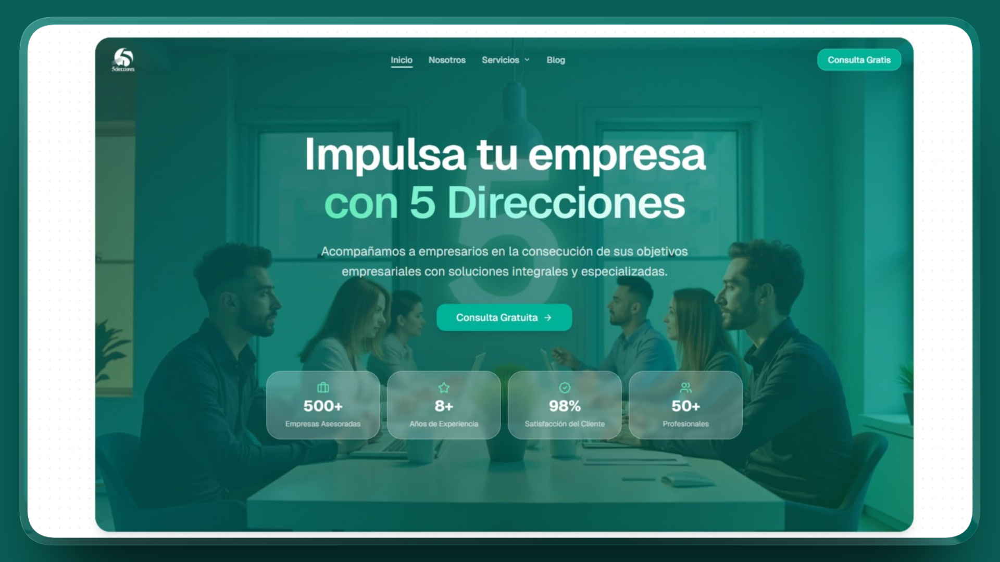

# 5 Direcciones - Corporate Landing Page

This repository contains the source code for the official landing page of 5 Direcciones, a consulting firm based in Medellín, Colombia, that provides comprehensive business solutions, including administrative, financial, legal, and human resources management.

## Live Site

https://5direcciones.vercel.app/

## About the Project

5 Direcciones helps entrepreneurs and companies achieve their business goals through specialized, integrated solutions. This website acts as a digital hub for potential clients to explore services, learn about the firm's history, access professional courses, and initiate contact for consultations.

**Core Areas of Expertise:**

**Administrative Direction:** Strategic planning and operational management.

**Accounting & Finance:** Tax strategy, fiscal compliance, and valuation.

**Project Management:** Digital transformation, web development, and marketing.

**Human Resources:** Organizational development and talent acquisition.

**Legal Services:** Trademark registration, copyright, and industrial property protection.

## Stack

**Framework:** Astro

**Deployment:** Vercel

**Styling:** TailwindCSS

## Contact Information

**Office:** Tv. 79c # 80-32, El Diamante, Robledo, Medellín, Colombia.

**Phone:** +57 301 393 6616

**Email:** 5direccionescol@gmail.com
